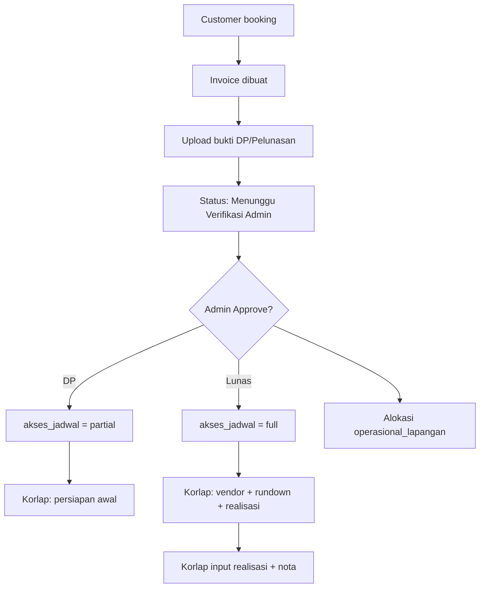

# Modul SIM Pembayaran — Brilliant WO

Sistem Informasi Manajemen pembayaran yang menghubungkan **Customer**, **Admin**, dan **Tim Lapangan** dengan validasi ketat DP vs Lunas.

> **Stack proyek:** Laravel 11 + Eloquent + Blade + Tailwind CSS  
> Spesifikasi Node.js/Express di bagian B disediakan sebagai **referensi equivalent API**; implementasi aktif ada di Laravel.

---

## A. Skema Database (SQL)

File lengkap: [`database/schema/sim_pembayaran.sql`](../database/schema/sim_pembayaran.sql)

### Relasi inti

```
users (customer | admin | lapangan)
  └── pesanans
        ├── invoices
        │     └── pembayaran_konfirmasis
        ├── vendor_meetings / rundowns  (jadwal_event)
        ├── operasional_lapangan        (alokasi admin → korlap)
        └── realisasi_operasional       (laporan + bukti nota korlap)
```

### Field kunci `pesanans`

| Kolom | Nilai | Arti |
|-------|-------|------|
| `status_pembayaran` | `unpaid` / `dp_paid` / `fully_paid` | Tahap verifikasi pembayaran |
| `akses_jadwal` | `none` / `partial` / `full` | Gembok akses jadwal lapangan |
| `status_pemesanan` | `pending` / `on_progress` / `confirmed` | Workflow booking |

### Aturan akses jadwal

| Status | `akses_jadwal` | Tim Lapangan |
|--------|----------------|--------------|
| Belum bayar | `none` | Tidak bisa akses |
| DP terverifikasi | `partial` | Koordinasi internal & persiapan awal saja |
| Lunas | `full` | Vendor eksternal, rundown Hari-H, realisasi dana |

Jalankan migration:

```bash
php artisan migrate
```

---

## B. Logika Backend

### B.1 Laravel (implementasi aktif)

#### Service workflow pembayaran
`app/Services/PaymentWorkflowService.php`

- Dipanggil saat admin **Approve** bukti transfer
- Update otomatis: `status_pembayaran`, `akses_jadwal`, alokasi `operasional_lapangan`

#### Middleware pembatas jadwal
`app/Http/Middleware/EnsureScheduleAccess.php`

```php
// Route contoh — vendor status hanya jika lunas
Route::post('/pesanan/{pesanan}/vendor-status', ...)
    ->middleware('schedule.access:full');
```

#### Service cek akses item timeline
`app/Services/ScheduleAccessService.php`

```php
ScheduleAccessService::canAccessTimelineItem($pesanan, $timelineItem);
ScheduleAccessService::canAccessVendorList($pesanan);
ScheduleAccessService::lockLabel($pesanan); // "Terkunci — Menunggu Pelunasan"
```

#### Endpoint utama

| Role | Method | Route | Fungsi |
|------|--------|-------|--------|
| Customer | POST | `/customer/pembayaran/konfirmasi/{invoice}` | Upload bukti DP/Pelunasan |
| Admin | POST | `/admin/pembayaran/konfirmasi/{id}/setujui` | Verifikasi + buka gembok jadwal |
| Admin | POST | `/admin/pembayaran/konfirmasi/{id}/tolak` | Tolak bukti |
| Admin | POST | `/admin/booking/{pesanan}/verify-dp` | Verifikasi DP manual + assign Korlap |
| Admin | POST | `/admin/booking/{pesanan}/verify-pelunasan` | Verifikasi lunas manual |
| Admin | POST | `/admin/booking/{pesanan}/operasional` | Alokasi uang operasional lapangan |
| Lapangan | GET | `/lapangan/pesanan/{pesanan}/realisasi` | Form laporan realisasi |
| Lapangan | POST | `/lapangan/pesanan/{pesanan}/realisasi/{ops}` | Upload nota + nominal |

### B.2 Equivalent Node.js / Express (referensi)

```javascript
// middleware/checkScheduleAccess.js
function requireScheduleAccess(level = 'partial') {
  return async (req, res, next) => {
    const pesanan = await Pesanan.findByPk(req.params.pesananId);
    if (!pesanan || pesanan.korlap_id !== req.user.id) {
      return res.status(403).json({ error: 'Forbidden' });
    }
    if (!['dp_paid', 'fully_paid'].includes(pesanan.status_pembayaran)) {
      return res.status(403).json({ error: 'Belum verifikasi DP' });
    }
    if (level === 'full' && pesanan.akses_jadwal !== 'full') {
      return res.status(403).json({ error: 'Menunggu pelunasan penuh' });
    }
    next();
  };
}

// POST /api/customer/payments/:invoiceId/proof
router.post('/payments/:invoiceId/proof', upload.single('bukti'), async (req, res) => {
  const row = await PembayaranKonfirmasi.create({
    invoice_id: req.params.invoiceId,
    jenis_pembayaran: req.body.jenis_pembayaran, // DP | Pelunasan
    status: 'Menunggu Konfirmasi',
    bukti_transfer: req.file.path,
  });
  res.json({ message: 'Menunggu Verifikasi Admin', data: row });
});

// POST /api/admin/payments/:id/approve
router.post('/payments/:id/approve', adminOnly, async (req, res) => {
  const k = await PembayaranKonfirmasi.findByPk(req.params.id);
  await k.update({ status: 'Disetujui' });
  await syncPaymentWorkflow(k); // set dp_paid/full + akses_jadwal + operasional
  res.json({ ok: true });
});

// POST /api/lapangan/realisasi
router.post('/realisasi', requireScheduleAccess('full'), upload.single('bukti_nota'), ...);
```

---

## C. Desain UI (Tailwind / Blade)

### Komponen

| Komponen | Path | Fungsi |
|----------|------|--------|
| Kartu status pembayaran | `resources/views/components/payment-status-card.blade.php` | Badge DP/Lunas + indikator akses jadwal |
| Timeline terkunci | `resources/views/components/jadwal-timeline-item.blade.php` | Ikon gembok + teks "Terkunci — Menunggu Pelunasan" |

### Penggunaan

```blade
<x-payment-status-card :pesanan="$pesanan" :invoice="$invoice" panel="customer" />

<x-jadwal-timeline-item :item="$item" :pesanan="$pesanan" panel="lapangan" />
```

### Halaman terintegrasi

- **Customer:** `/customer/pembayaran` — upload bukti
- **Admin:** `/admin/pembayaran` — antrian verifikasi
- **Lapangan:** `/lapangan/pesanan/{id}` — overlay gembok vendor & rundown saat DP
- **Lapangan:** `/lapangan/pesanan/{id}/realisasi` — input realisasi + nota

---

## Alur Workflow Ringkas



---

## Konfigurasi

`config/pembayaran.php`:

- `dp_persen` — minimal DP (default 30%)
- `operasional_persen_dp` — % alokasi ops dari nominal DP
- `operasional_persen_pelunasan` — % alokasi ops dari pelunasan
